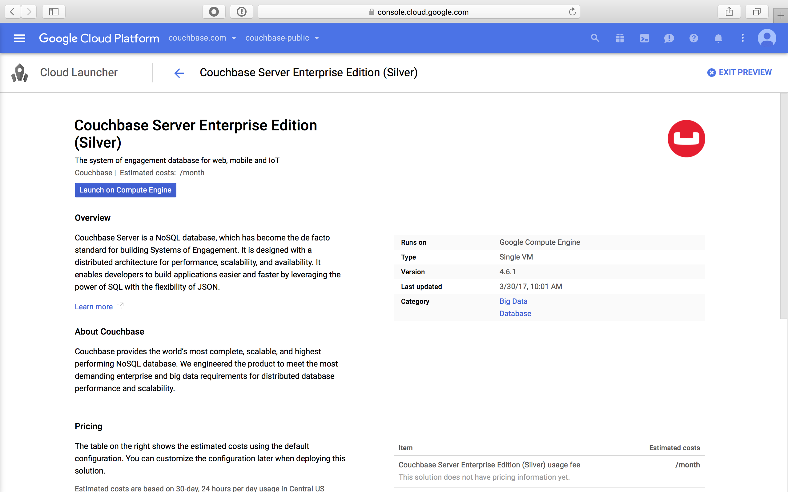
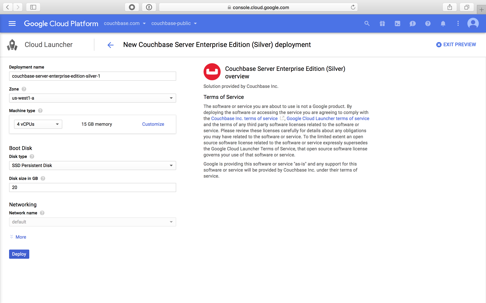
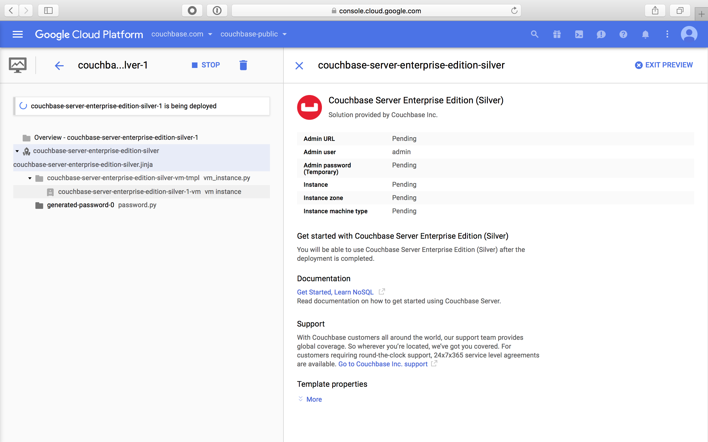
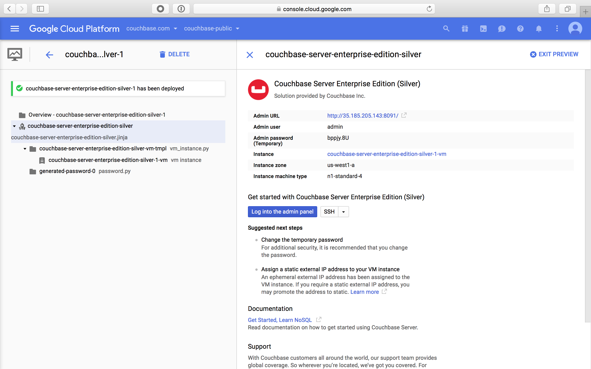
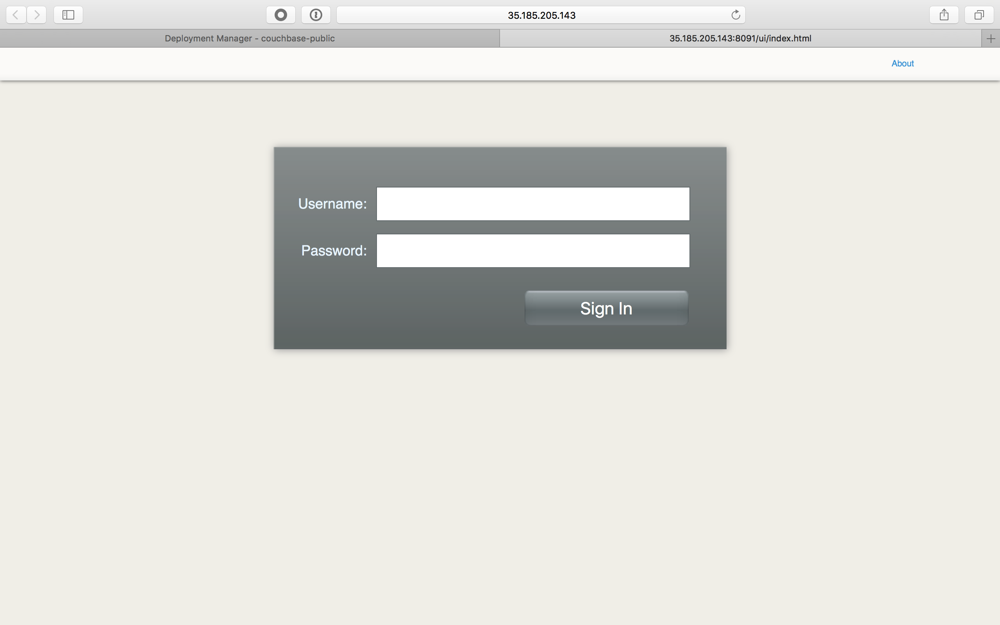
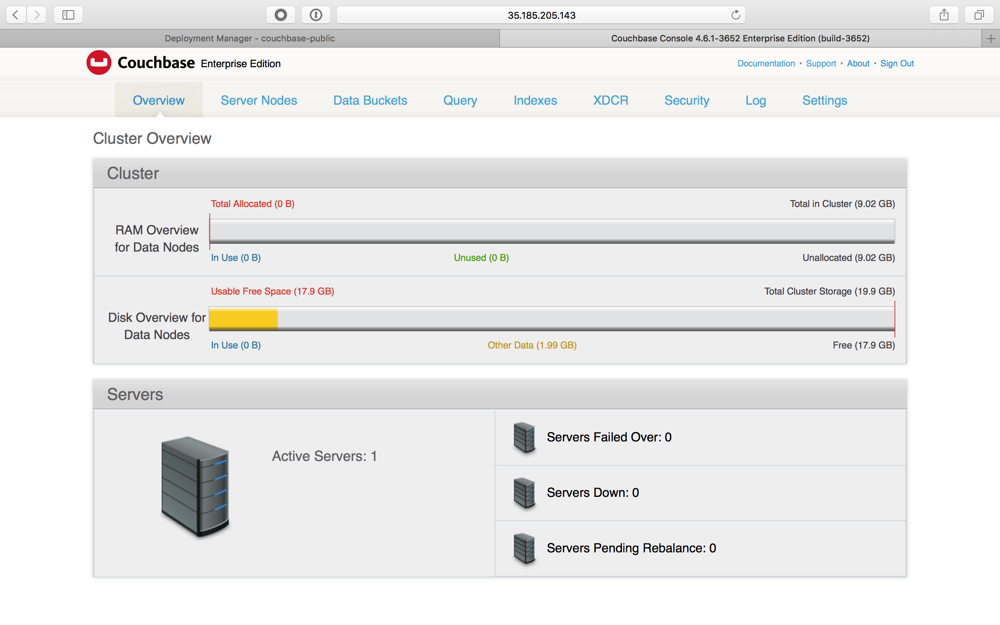
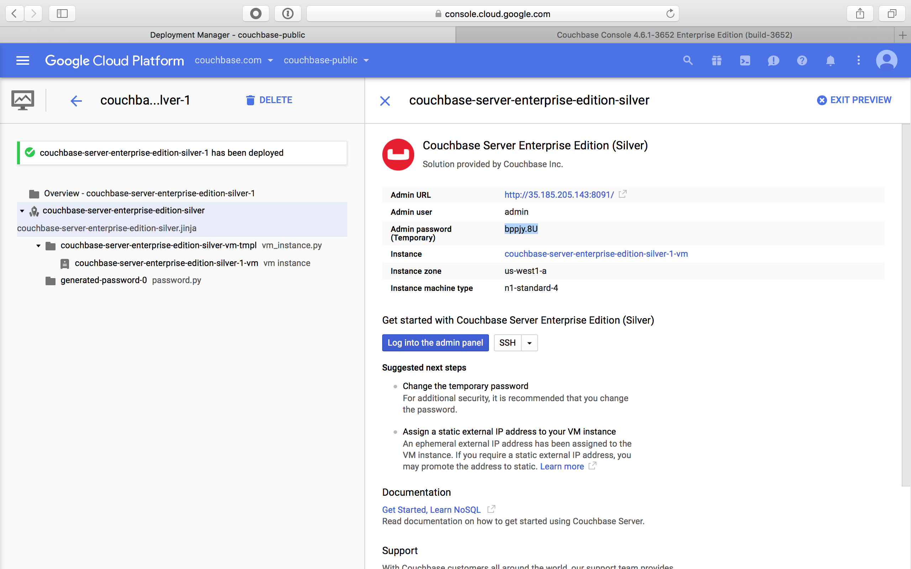
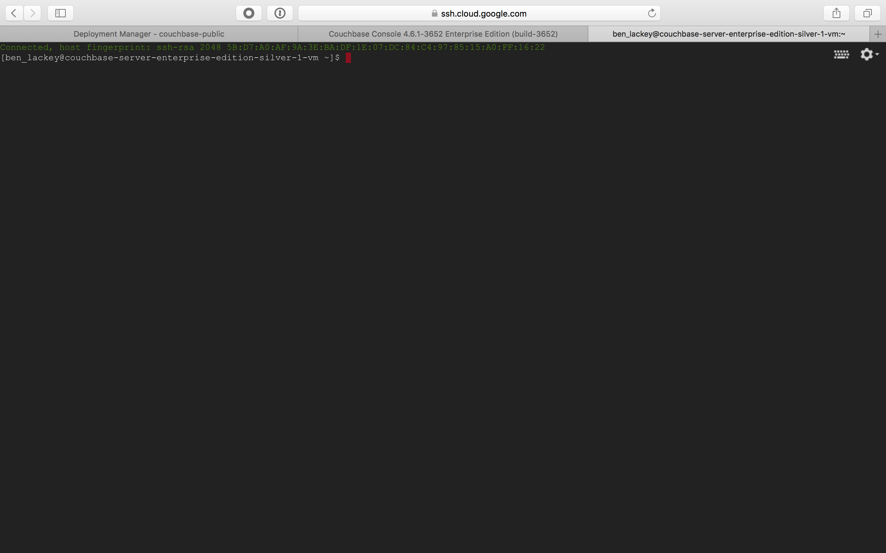
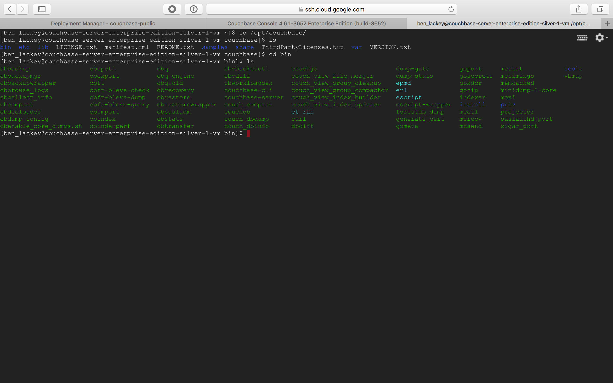

# Getting Started

This document describes how to get started using the Couchbase virtual machine image on Google Cloud Launcher.  Cloud Launcher is a GUI for deploying 3rd party software in Google Cloud Platform (GCP).

## Deploying with Cloud Launcher

First, navigate to the Couchbase Cloud Launcher page here.

Now click "Launch on Compute Engine."  This will take you to a page where you can configure the VM settings.

Now click "Deploy."

You'll be redirected to this page, showing the VM deploying.  That will take several minutes.  Once deployed, the page will look like this:

## Logging into Couchbase Administrator

Great.  You've now deployed Couchbase.  One next step is to log into the administrator and look around.

Make a note of the admin username and password.  You can use these to login to the Couchbase administrator.  To do so, click the "Log into the admin panel" button.

Enter the username and password from the previous step.  You can now see the Couchbase administrator.

Feel free to look around the various tabs.

## Starting a Terminal Session

Connecting to a node via SSH in GCP is really easy.  First, return to the tab showing the deployment.

Click the SSH button to open a connection to the node.

Wait until the keys are done transferring.  At that point, you will be presented with an SSH console running in your web browser.

Couchbase is installed under `/opt/couchbase`.  There are tools in the `/opt/couchbase/bin` directory, including `couchbase-cli`.

Try running commands in bin to see what they do.

## Next Steps

You've now deployed a Couchbase node, accessed the administrator user interface and connected to that node via SSH.  For more steps and detailed tutorials please see the Couchbase [developer website](https://developer.couchbase.com/).  Another good starting point is the Couchbase [reference application](https://www.couchbase.com/get-started-developing-nosql#Try_The_Reference_Application).
